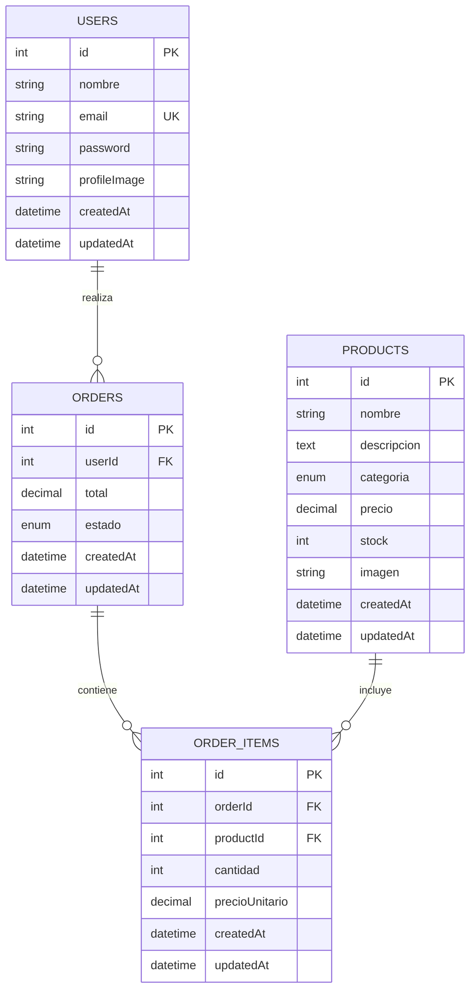

# Diagrama entidad-relación

## Relaciones

- Un usuario puede realizar muchos pedidos.
- Un pedido pertenece a un usuario.
- Un pedido contiene muchos detalles de pedido.
- Un producto puede aparecer en muchos detalles de pedido.
- `order_items` conecta los pedidos con los productos y guarda la cantidad y el precio unitario.